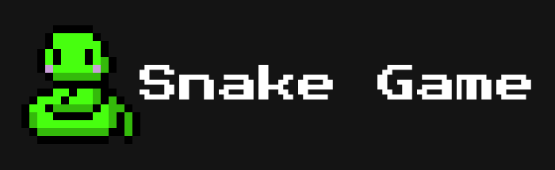
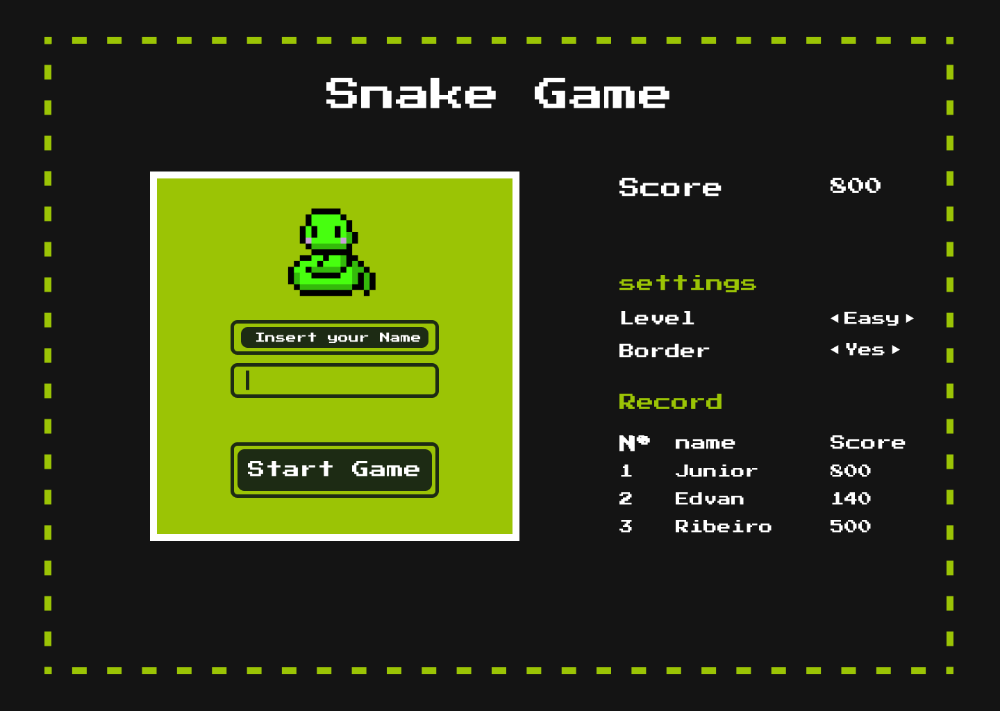
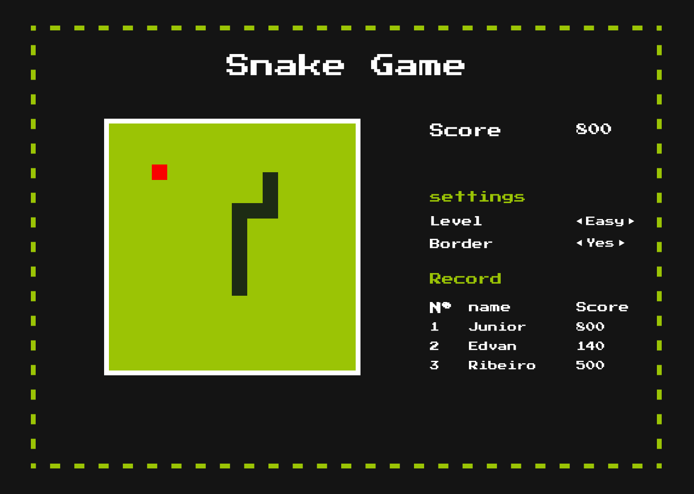
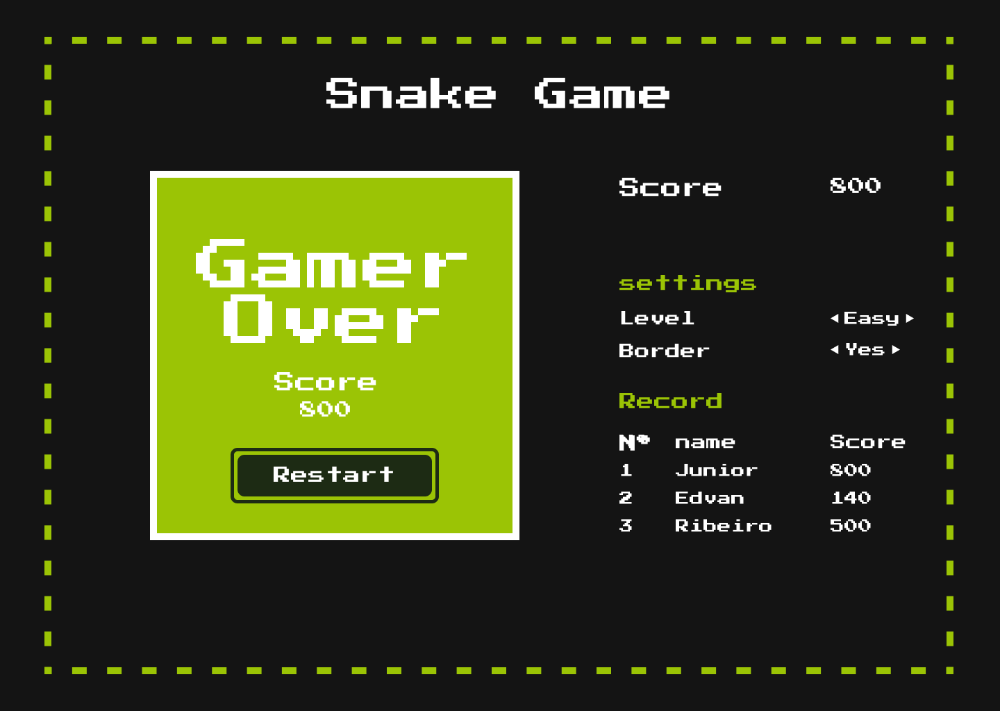

    

## :snake: INTRODUÇÃO

Esse repositório é referente as implementações de melhorias que fiz sobre o projeto de jogo da cobrinha, abordado no bootcamp - HTML Web Developer da [Digital Innovation One](https://digitalinnovation.one/). 

Para jogar [**clique aqui**](https://ejunior01.github.io/snakeGame-v2/), e caso queira acessar os demais projetos e conteúdos desenvolvidos no bootcamp, ou a implementação do jogo desenvolvido através das aulas do bootcamp pode [clicar aqui](https://github.com/ejunior01/html_web_developer).

Obs.: Projeto implementado para versões Desktop apenas, visto que a navegação é feita através das setas do teclado.

---

### Implementações

- Implementação de tela de início, com campo de nome para o jogador. 
- Validação se o campo nome foi preenchido, e caso não tenha sido exibição de uma mensagem de aviso.
- Implementação de tela de fim de jogo com exibição da pontuação, e opção de recomeçar o jogo.
- Salvar os três maiores recordes do jogo no Local Storage do browser que esteja executando o jogo.

### Tarefas em aberto 

- [ ] Habilitar opção de escolha para regra de bordas.
- [ ] Habilitar opção de escolha dos níveis de dificuldades do jogo.

---

### :snake: Layout da estrutura

#### :computer: Tela inicial

<h4 align="center">
    
</h4>

---

#### :computer: Tela do Jogo

<h4 align="center">
    
</h4>

---

#### :computer: Tela de fim de jogo

<h4 align="center">
    
</h4>

---

#### Status do Projeto: Em desenvolvimento :construction:

---

#### :point_up: Contribuição

Caso tenha tenha alguma sugestão de melhoraria para o projeto em geral ou correção de algum :bug:, pode me informe ou realizar a abertura de um Pull Requests! Quaisquer contribuições são muito apreciadas.😄

---

### :pencil: Licença

	Copyright (c) 2020 Edvan Ribeiro
     
    Esse projeto está sob a licença MIT. Veja o arquivo <a href="https://github.com/ejunior01/snakeGame-v2/blob/master/LICENSE">LICENSE</a> para mais detalhes.

